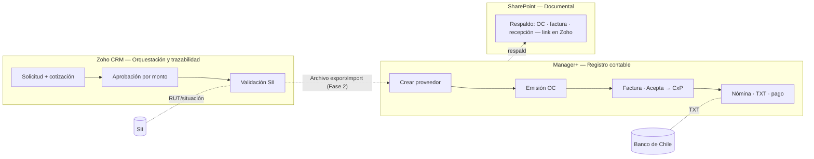

# Diseño — Automatización del proceso de Compras y Proveedores (sistema puente)

**Cliente:** MundoSocios — CChC
**Consultor:** JR Jottar (IBS Solución)
**Fecha:** 2026-06-18
**Inicio del proyecto:** 2026-07-01
**Horizonte:** ~5 meses (hasta migración a Odoo, ~nov-2026)

---

> **⚠️ FUERA DE ALCANCE (decisión del cliente, 2026-07-06):** MundoSocios decidió **no** construir la capa de orquestación en Zoho CRM descrita en este documento (módulos personalizados, Blueprint, Approval Process, Workflow Rules, Deluge — Fases 1 y 2 de abajo). El alcance vigente se acota a **Fase 0** (§6) más las herramientas ya operativas en `Herramientas Operativas/` (Excel) y `Validador SII (Python standalone)/`, que cubren verificación de proveedor, aprobación por tramo y carga manual a Manager+ sin necesidad de Zoho CRM. Este documento queda como **referencia histórica de diseño**, reutilizable si el proyecto Zoho se retoma antes de la migración a Odoo. Detalle del recorte en `Build/00_INDICE - Guia de implementacion.md` §5.

---

## 1. Contexto y objetivo

MundoSocios migrará a **Odoo** en ~5 meses. Antes de eso necesita **eficientar el proceso actual de Compras y Proveedores** usando el stack vigente: **Zoho One (CRM/Forms/Campaigns), Manager+ (ERP contable), Excel, Outlook y SharePoint**.

**Objetivo:** construir un *sistema puente* que reduzca el trabajo manual y dé trazabilidad al proceso, **sin desarmar** la operación contable existente y **sin construir nada que se bote en la migración** a Odoo.

**Principio de diseño rector:** maximizar activos portables a Odoo (datos limpios, reglas documentadas, validadores reutilizables) y minimizar el desarrollo específico de plataforma.

## 2. Restricciones y premisas

- **Tooling Zoho disponible:** solo CRM, Forms y Campaigns. **No hay Creator ni Flow.** La orquestación se hace con capacidades nativas de Zoho CRM: módulos personalizados, Blueprint, Approval Processes, Workflow Rules y funciones Deluge.
- **Dominio cchc.cl no accesible:** la automatización no puede depender de recursos en ese dominio; vive en el tenant/herramientas autorizadas (Zoho One, IBS, SharePoint MundoSocios).
- **Manager+:** la integración será por **archivo de exportación/importación, NO API** (decisión confirmada). No se asume conectividad programática con Manager+.
- **Chequeos web:** la validación tributaria se hace contra el **SII (www.sii.cl)**.
- **Autorizaciones por reglas:** existen aprobaciones por montos, presupuestos y otras políticas.

## 3. Arquitectura: 3 capas con dueño claro

| Capa | Herramienta | Es dueña de… |
|---|---|---|
| **Orquestación y trazabilidad** | **Zoho CRM** (lo nuevo) | El *estado* del proceso, el expediente, las aprobaciones pre-OC, la validación SII |
| **Registro contable / pagos** | **Manager+** (se mantiene) | El dato contable: proveedor formal, OC, factura, cuenta por pagar, nómina, TXT, conciliación |
| **Documental** | **SharePoint MundoSocios** (se mantiene) | Los respaldos físicos (OC, factura, recepción, formulario) |

**Idea central:** Zoho CRM es la **única fuente de verdad del *estado* y la trazabilidad** de cada compra (el tablero de control). Manager+ sigue siendo dueño del dato contable y SharePoint de los documentos. Zoho **no duplica** Manager+: guarda el N° de OC y el **link** al expediente en SharePoint. La sincronización entre Zoho y Manager+ es por **archivo** (Fase 2).

## 4. Flujo combinado end-to-end

| # | Etapa | Dónde ocurre la acción | Qué aporta Zoho (capa nueva) |
|---|---|---|---|
| 1 | Solicitud de compra | Zoho Forms → CRM | Intake con campos obligatorios (centro de costo, cuenta, presupuesto) |
| 2 | Cotización | Zoho (módulo Cotizaciones) | Adjuntar y comparar, motivo de selección |
| 3 | Aprobación presupuesto/selección | Zoho Approval | Matriz por monto + presupuesto disponible visible al aprobar |
| 4 | Validación + creación proveedor | SII (Deluge) + Manager+ | Valida RUT/situación tributaria; checklist de campos críticos para que el TXT no falle |
| 5 | Emisión OC | Manager+ | Refleja estado y N° OC; control de OC abiertas |
| 6 | Recepción factura (Acepta) | Manager+ | Marca estado "facturada", asocia a la solicitud |
| 7 | Recepción conforme | hoy correo → Zoho captura la confirmación | Cierra el gap de trazabilidad actual |
| 8 | Respaldo documental | SharePoint | Guarda el link al expediente |
| 9 | Nómina + TXT + apoderados | Manager+ / Banco | Marca estado "en pago / pagado" |
| 10 | Pago + conciliación | Manager+ | Cierra el expediente, reportes |

## 5. Componentes a construir (Zoho CRM)

- **Módulos personalizados:** *Solicitudes*, *Cotizaciones*, *Proveedores* (maestro), *Órdenes de Compra* (registro/espejo del N° y estado de Manager+).
- **Blueprint:** máquina de estados con los 10 estados del flujo, campos obligatorios por etapa y transiciones controladas. Refleja también los pasos cuya acción física ocurre en Manager+ (OC emitida, facturada, en pago, pagado).
- **Approval Processes / Workflow Rules:** matriz de aprobaciones por monto / presupuesto / centro de costo; recordatorios y alertas. Ver matriz en §5.1.
- **Validador SII:** la consulta oficial de "situación tributaria de terceros" (`www2.sii.cl/stc/noauthz`) tiene fila de espera y captcha → no automatizable directo. **Fase 1:** validación manual-asistida (operador consulta y marca el campo). **Fase 2:** función Deluge que llama una **API REST de terceros** que envuelve la consulta (candidatos: BaseAPI, API Gateway). Reutilizable y portable.
- **Checklist de campos críticos del proveedor:** garantiza que los datos que alimentan el TXT bancario estén completos antes de avanzar.
- **Dashboards:** OC abiertas, presupuesto consumido, estados del proceso, tiempos por etapa.

### 5.1 Matriz de aprobaciones (paramétrica)

Montos en CLP **bruto (con IVA)**. La matriz debe quedar **parametrizable** (umbrales y aprobadores ajustables sin reconstruir el Blueprint).

| Tramo (CLP bruto c/IVA) | Aprobador |
|---|---|
| Hasta 500.000 | Dueño del presupuesto |
| 500.001 – 1.000.000 | Cecilia Ramírez |
| 1.000.001 – 5.000.000 | Patricio Fernández (Adm. y Finanzas) |
| Sobre 5.000.000 | Doble firma: Patricio Fernández + Constanza Daniels (Gerente General) |

## 6. Plan por fases

| Fase | Ventana | Entregable | Depende de Manager+ |
|---|---|---|---|
| **0 — Estandarizar** | 01–15 jul | Formulario Zoho con campos obligatorios, plantilla única de OC, estructura de carpetas SharePoint, checklist de campos críticos del proveedor, matriz de aprobaciones documentada | No |
| **1 — Proceso y aprobaciones** | jul–ago | Módulos personalizados + Blueprint (10 estados) + Approval Processes + dashboards. Sync a Manager+ aún manual, con trazabilidad total | No |
| **2 — Integraciones** | ago–sep | Validador SII automático (Deluge); **sync con Manager+ por archivo export/import** (no API); alertas de presupuesto y recordatorios de pago | Sí (formato de archivo) |
| **Cierre pre-Odoo** | oct | Maestros limpios + procesos documentados = insumo directo de la migración | No |

La Fase 0 entrega valor desde el día 1 y es 100% a prueba de migración. Las Fases 0–1 no dependen de Manager+.

## 7. Integración con Manager+ (por archivo, no API)

- **Mecanismo:** exportación/importación de archivos (formato a confirmar con el equipo Manager+: CSV/Excel/TXT).
- **Pendiente a despejar en Fase 2:** qué entidades admite Manager+ por carga masiva (proveedores, OC, documentos) y con qué layout exacto. Esto define el diseño de los exportadores en Zoho.
- **Dirección del dato:** Zoho genera archivos para alta de proveedor y OC; los estados/N° de Manager+ se reflejan de vuelta en Zoho (carga manual o archivo) para mantener la trazabilidad.

## 8. Activos portables a Odoo

Maestro de proveedores validado, estructura de centros de costo y cuentas, matriz de aprobaciones, definición de estados del proceso y el validador SII. Ninguno se descarta en la migración.

## 8.1 Operación productiva y gobierno de cuentas

- **Responsable funcional (MundoSocios):** Patricio Fernández (Adm. y Finanzas).
- **Operación en producción desde cuentas de MundoSocios**, no desde cuentas de consultoría. El desarrollo/configuración puede hacerse en ambiente de trabajo, pero el **productivo corre con identidades MundoSocios** y sus permisos.
- **Respaldo documental en SharePoint:** se opera en productivo con la **cuenta de Patricio Fernández**. Las funciones que escriben/leen SharePoint y las que envían correos de aprobación deben quedar configuradas bajo cuentas MundoSocios autorizadas.
- **Implicancia de diseño:** desde ya, evitar dependencias de cuentas personales del consultor; parametrizar usuarios/owners de cada paso (aprobadores, dueño del respaldo, remitente de notificaciones) para poder reasignarlos a identidades MundoSocios sin reconstruir.
- **Accesos a habilitar (checklist temprano):** usuario Zoho CRM para aprobadores y operadores; cuenta de servicio/owner para SharePoint (Patricio); permisos sobre la biblioteca documental de MundoSocios; buzón de notificaciones.

## 9. Riesgos e incógnitas

- **Formato de carga de Manager+:** condiciona la Fase 2 (no bloquea Fases 0–1).
- **Servicio de validación SII:** definir vía (servicio web/tercero) accesible desde Deluge.
- **Restricción cchc.cl:** el productivo opera con cuentas MundoSocios (SharePoint bajo cuenta de Patricio Fernández). Confirmar que esas identidades y la biblioteca documental son accesibles para las funciones Deluge/notificaciones, y que no dependen de recursos del dominio cchc.cl no autorizado.
- **Alcance:** este diseño cubre **solo Compras y Proveedores**. Recaudación/Cobranza y otros procesos de Adm. y Finanzas quedan fuera de esta etapa.

## 10. Fuentes (levantamiento)

- `Resumen Flujos Cotización Inicial Odoo.docx`
- `Levantamiento Adm. y Finanzas/Flujo de Compras 15-06-26.docx`
- `Flujos y Manuales Adm. y Finanzas/` (creación de proveedores, solicitud de cotizaciones, ingreso de facturas/boletas, nóminas de pago, conciliación, rendiciones).
