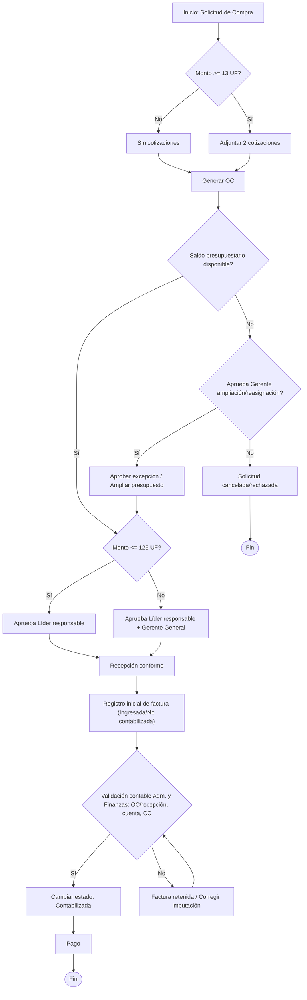
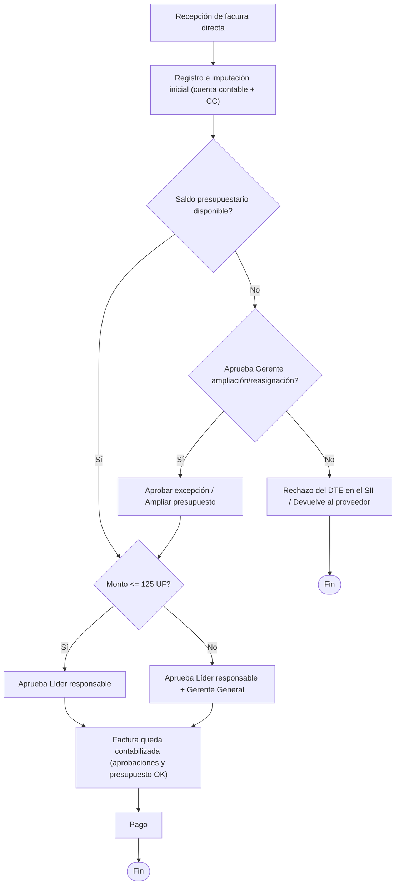

CONFIDENCIAL — MundoSocios CChC

# Flujo de Aprobación de Compras para Odoo (Caso 1 con OC · Caso 2 factura directa)

**Proyecto:** Implementación Odoo Enterprise — MundoSocios CChC ·
**Versión:** 1.1 — 2026-08-18
**Fuentes:** láminas "Flujo de compras Con OC / Sin OC" (PF, 2026-08-07)
y flujos Caso 1 / Caso 2 (agosto 2026). Complementa el
`BP_Flujo_Compras_MundoSocios_v2.2.md` §2.6.

> **v1.1:** se consolidan las láminas PF y los flujos Caso 1/Caso 2 en
> una sola versión canónica. Corrección respecto de la lámina 3 y el
> diagrama ASCII del Caso 1: la **factura retenida vuelve a la
> validación contable** una vez corregida la imputación — en las
> versiones anteriores desembocaba (por error de dibujo) directo en
> Pago.

## Reglas del modelo (ambos casos)

| Regla | Definición |
|---|---|
| Umbral de cotización | ≥ **13 UF**: adjuntar 2 cotizaciones. Bajo 13 UF: sin cotizaciones |
| Presupuesto | Bloqueante: sin saldo presupuestario el flujo se detiene; solo el **Gerente** aprueba ampliación/reasignación (excepción) |
| Nivel de aprobación | ≤ **125 UF**: Líder responsable · > **125 UF**: Líder responsable + Gerente General (secuencial) |
| Multi-partida | Gasto dividido en varias cuentas/CC: **cada Líder de CC aprueba su fracción** para liberar el flujo |
| Moneda | Umbrales en UF (paramétricos). Equivalencias de referencia: 13 UF ≈ $531.000 · 125 UF ≈ $5.100.000 — calzan con los bordes de la matriz CLP del puente |

**Vigencia:** este esquema rige **en Odoo**. Hasta la salida en
producción, en el puente sigue la matriz CLP con aprobadores nominados
(BP v2.2 §2.5).

## Caso 1 — Compra vía Orden de Compra

## Caso 2 — Factura directa (sin OC previa)

## Implicancias de configuración en Odoo

1. **Aprobación por orden completa es nativa** (Purchase, niveles por
   monto en UF vía moneda secundaria o campo calculado). La regla
   **multi-partida** (cada Líder de CC aprueba su fracción) **no es
   nativa**: requiere Studio o desarrollo sobre las líneas analíticas —
   dimensionarla con el partner (afecta DP-03).
2. **Presupuesto bloqueante** requiere Presupuestos (Contabilidad) con
   verificación en la confirmación de la OC/factura, y un permiso de
   excepción restringido al rol Gerente.
3. **Caso 2 — plazo legal:** el rechazo del DTE en el SII solo es
   posible dentro de los **8 días corridos** desde la recepción
   (aceptación tácita después). El circuito
   registro→presupuesto→decisión debe caber en esa ventana; a volumen
   actual (~84 docs/mes) es viable si la revisión es semanal o más
   frecuente.
4. **Factura retenida** (Caso 1): estado bloqueante que impide el pago
   hasta re-validación — en Odoo, retención del asiento en borrador o
   bloqueo de pago, nunca un paso hacia el lote de pago.

------------------------------------------------------------------------

Preparado por: José Ramón Jottar — JR Jottar Consultoría
Pendiente de validación por: Patricio Fernández (Adm. y Finanzas)
