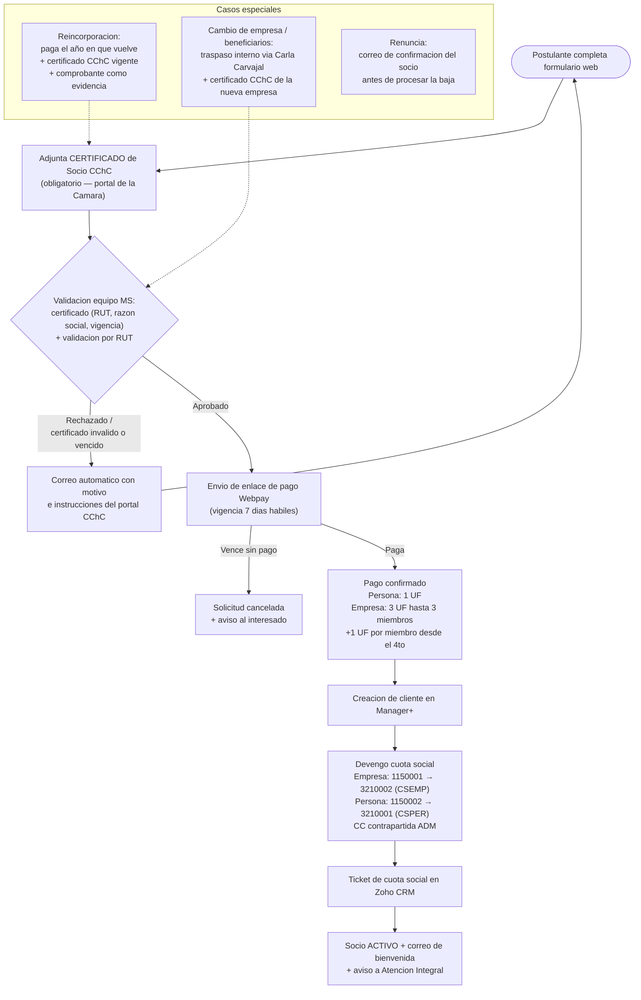
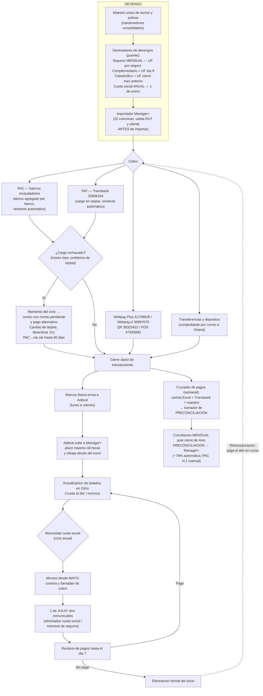

# Diagramas de flujo — Cobranza Cuota Social y Seguros (v2.0)

**Proyecto:** MundoSocios CChC · **Fecha:** 2026-07-08 · **Versión:** 2.0
Actualizan los diagramas de `FLUJOS DE PROCESO/BP Cobranza Cuota Social y Seguros/` (v1.0) con los cambios de julio 2026: certificado de Socio CChC obligatorio, valores/cuentas de cuota social verificados, UF por seguro, ciclo real de Addval, códigos de comercio Transbank, ciclo anual de morosidad y herramientas puente.
GitHub renderiza estos diagramas automáticamente; las versiones SVG/PNG exportadas están en esta misma carpeta.

---

## 1. Incorporación de nuevo socio + cuota social (v2.0)

**Cambios vs v1.0:** certificado CChC como paso obligatorio y criterio de rechazo · valores de cuota reales (reemplazan 1,44/0,48 UF) · cuentas cruzadas de persona verificadas · casos de reincorporación, traspaso y renuncia · sale Javiera Valdovinos del flujo (informa Carla; apoya Marcos Ibarra).

---

## 2. Recaudación y cobranza recurrente (v2.0)

**Cambios vs v1.0:** devengo desde maestro único con generadores validados al peso (fin del copiado mensual) · UF diferenciada por seguro · canales de cobro con códigos de comercio Transbank confirmados · ciclo real Addval (envío diario L-V por Marcos Ibarra, 48 h) · rechazos/reintentos y cambio de tarjeta · cruzador de pagos como paso semanal · conciliación mensual post cierre con PRECONCILIACIÓN (cartola en PDF y Excel; el TXT es solo la nómina de pagos) · ciclo anual de morosidad y eliminación con reincorporación pagando el año en curso.

---

**Pendientes marcados en el BP:** regla exacta de morosidad de seguros ("9") · cuál UF de cierre (ene/feb/mar) aplica a qué caso de cuota social · vigencia máxima del certificado CChC (propuesta: 30 días).
**Fuente de detalle:** `docs/flujos-proceso/BP_Devengo_Recaudacion_Cobranza_MundoSocios.md` y `BP_Procesos_Experiencia_Atencion_MundoSocios.md`.
